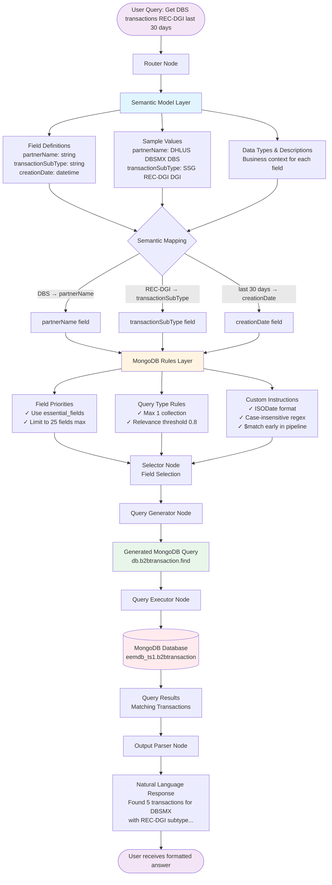

# MongoDB Agent AI - Architecture Diagram

## How Semantic Models + MongoDB Rules Process Queries

### Mermaid Diagram (Copy to mermaid.live or use in markdown renderers)



### ASCII Diagram (For presentations/documents)

```
┌─────────────────────────────────────────────────────────────────────────┐
│  USER QUERY: "Get DBS transactions, REC-DGI type, last 30 days"        │
└──────────────────────────────┬──────────────────────────────────────────┘
                               ▼
                    ┌──────────────────────┐
                    │   ROUTER NODE        │
                    │  (Query Analysis)    │
                    └──────────┬───────────┘
                               ▼
        ┌──────────────────────────────────────────────────┐
        │                                                  │
        ▼                                                  ▼
┌────────────────────────────┐              ┌────────────────────────────┐
│  LAYER 1: SEMANTIC MODELS  │              │  LAYER 2: MONGODB RULES    │
│  ========================  │              │  ======================    │
│                            │              │                            │
│  Field Definitions:        │              │  Field Priorities:         │
│  • partnerName: string     │              │  • essential_fields        │
│  • transactionSubType: str │              │  • high_priority_fields    │
│  • creationDate: datetime  │              │                            │
│                            │              │  Query Type Rules:         │
│  Sample Values:            │              │  • max_collections: 1      │
│  • DBS, DHLUS, DBSMX       │              │  • max_fields: 25          │
│  • REC-DGI, SSG, DGI       │              │  • relevance: 0.8          │
│                            │              │                            │
│  ↓ MAPPING RESULT:         │              │  Custom Instructions:      │
│  • DBS → partnerName       │              │  • Use ISODate()           │
│  • REC-DGI → txnSubType    │              │  • Case-insensitive regex  │
│  • 30 days → creationDate  │              │  • $match first            │
└────────────┬───────────────┘              └────────────┬───────────────┘
             │                                           │
             └───────────────────┬───────────────────────┘
                                 ▼
                    ┌────────────────────────┐
                    │   SELECTOR NODE        │
                    │  (Field Selection)     │
                    │  Selected: 10 fields   │
                    └────────────┬───────────┘
                                 ▼
                    ┌────────────────────────┐
                    │  QUERY GENERATOR NODE  │
                    │  (MongoDB Query Build) │
                    └────────────┬───────────┘
                                 ▼
        ┌────────────────────────────────────────────────┐
        │  GENERATED QUERY (Optimized & Validated):     │
        │  ============================================  │
        │  db.b2btransaction.find({                     │
        │    "partnerName": {                           │
        │      $regex: "DBS",                           │
        │      $options: "i"                            │
        │    },                                         │
        │    "transactionSubType": "REC-DGI",           │
        │    "creationDate": {                          │
        │      $gte: ISODate("2025-12-14")              │
        │    }                                          │
        │  })                                           │
        └────────────────────┬───────────────────────────┘
                             ▼
                ┌────────────────────────┐
                │  QUERY EXECUTOR NODE   │
                │  (Execute on MongoDB)  │
                └────────────┬───────────┘
                             ▼
                ┌────────────────────────┐
                │   MONGODB DATABASE     │
                │  eemdb_ts1.appuser     │
                │   b2btransaction       │
                └────────────┬───────────┘
                             ▼
                ┌────────────────────────┐
                │    QUERY RESULTS       │
                │  [5 matching txns]     │
                └────────────┬───────────┘
                             ▼
                ┌────────────────────────┐
                │  OUTPUT PARSER NODE    │
                │ (Format to Natural     │
                │  Language)             │
                └────────────┬───────────┘
                             ▼
        ┌────────────────────────────────────────────────┐
        │  NATURAL LANGUAGE RESPONSE:                   │
        │  ============================================  │
        │  Found 5 transactions for DBSMX partner:      │
        │  • Requisition: 12329609                      │
        │  • Type: REC-DGI                              │
        │  • Date: 2025-12-31                           │
        │  • Status: COMPLETE                           │
        └────────────────────────────────────────────────┘
```

### Simplified Flow Diagram

```
┌──────────┐     ┌─────────────┐     ┌──────────────┐     ┌──────────┐     ┌────────┐
│          │     │  SEMANTIC   │     │   MONGODB    │     │          │     │        │
│   USER   │────▶│   MODELS    │────▶│    RULES     │────▶│  QUERY   │────▶│ MONGO  │
│  QUERY   │     │  (Business  │     │ (Governance) │     │ EXECUTOR │     │   DB   │
│          │     │   Context)  │     │              │     │          │     │        │
└──────────┘     └─────────────┘     └──────────────┘     └──────────┘     └───┬────┘
                                                                                │
                                                                                ▼
┌──────────┐     ┌─────────────┐                                         ┌──────────┐
│          │     │   OUTPUT    │                                         │          │
│   USER   │◀────│   PARSER    │◀────────────────────────────────────────│ RESULTS  │
│ RESPONSE │     │  (Format)   │                                         │          │
└──────────┘     └─────────────┘                                         └──────────┘
```

## Color-Coded Layers Legend

- 🔵 **Blue** = Semantic Models Layer (Business Context)
- 🟡 **Yellow** = MongoDB Rules Layer (Query Governance)
- 🟢 **Green** = Generated Query (Validated Output)
- 🔴 **Red** = Database Execution
- 🟣 **Purple** = User Interaction Points

## Key Takeaways from Architecture

1. **Dual-Layer Validation**: Every query passes through both semantic and rules layers
2. **Separation of Concerns**: Business context (WHAT) separate from query optimization (HOW)
3. **LangGraph Nodes**: Each step is a specialized node in the graph
4. **Guaranteed Optimization**: Rules layer ensures production-grade queries
5. **Transparency**: Debug mode shows exact flow through each node
