# 🚀 MongoDB Agent - Open Source Distribution

**Version:** 1.0.0  
**License:** MIT  
**Package:** mongodb-agent

A powerful AI-powered agent for querying MongoDB databases using natural language. Built with LangGraph and supporting multiple LLM providers.

---

## 📦 What's Inside?

```
mongodb-agent-ai/
├── README.md                          # This file
├── LICENSE                            # MIT License
├── QUICK_START.md                     # 5-minute setup guide  
├── setup.sh                           # Automated setup script
├── start_custom_server.sh             # Server start script
├── .env.template                      # Configuration template
├── mongodb_agent-1.0.0-py3-none-any.whl  # Package wheel
├── docs/                              # Documentation
│   ├── USER_GUIDE.md                  # Complete user guide
│   ├── API_REFERENCE.md               # API documentation
│   ├── CONFIGURATION.md               # Configuration guide
│   └── TROUBLESHOOTING.md             # Common issues
├── examples/                          # Example scripts
│   ├── basic_query.py                 # Simple query
│   ├── batch_queries.py               # Batch processing
│   └── custom_integration.py          # Integration example
└── semantic_models/                   # YAML semantic models
    └── example_collection.yaml        # Example model
```

---

## ⚡ Quick Start (3 Steps)

### Step 1: Install
```bash
pip install mongodb_agent-1.0.0-py3-none-any.whl
```

### Step 2: Configure
```bash
# Copy template and add your credentials
cp .env.template .env
nano .env  # Edit with your LLM and MongoDB credentials
```

### Step 3: Run
```bash
# Start MCP server (for Claude Desktop integration)
python3 -m mongodb_agent.cli server --port 8000

# OR start REST API server (for HTTP/API access)
python3 -m mongodb_agent.cli server --port 8000 --mode rest
```

---

## 🎯 Features

- 🤖 **Natural Language Queries** - Ask questions in plain English
- 🔌 **Multiple LLM Providers** - OpenAI, Azure OpenAI, Anthropic Claude
- 📊 **Semantic Models** - Define your MongoDB schema in YAML (local files or Weaviate)
- 🚀 **Model Context Protocol (MCP)** - Integrate with Claude Desktop
- 🌐 **REST API** - HTTP endpoints for easy integration
- 💾 **Token Caching** - Efficient OAuth token management
- 🎨 **Flexible Configuration** - Environment variables or config files
- 🔀 **Dual MongoDB Modes** - Direct PyMongo or MCP Protocol

---

## 📋 Requirements

- **Python**: 3.9 or higher
- **MongoDB**: MongoDB instance (local or remote)
- **LLM API**: OpenAI, Azure OpenAI, or Anthropic API key
- **Optional**: MCP-compatible client (e.g., Claude Desktop)

---

## 🔧 Configuration

### LLM Providers

The agent supports multiple LLM providers:

**OpenAI (Easiest)**
```bash
LLM_PROVIDER=openai
OPENAI_API_KEY=sk-your-key-here
OPENAI_MODEL=gpt-4o-mini
```

**Azure OpenAI**
```bash
LLM_PROVIDER=azure
AZURE_OPENAI_ENDPOINT=https://your-endpoint.openai.azure.com
AZURE_OPENAI_API_KEY=your-key
AZURE_OPENAI_DEPLOYMENT_NAME=gpt-4o-mini
```

**Anthropic Claude**
```bash
LLM_PROVIDER=anthropic
ANTHROPIC_API_KEY=your-key
```

### MongoDB Connection

**Via MCP (Recommended)**
```bash
MONGODB_MCP_ENDPOINT=http://localhost:3000/mongodb/query
MONGODB_CLIENT_ID=your-client-id
MONGODB_CLIENT_SECRET=your-client-secret
```

**Direct Connection**
```bash
MONGODB_URI=mongodb://localhost:27017
MONGODB_DATABASE=your_database
```

---

## 📚 Documentation

- **[QUICK_START.md](./QUICK_START.md)** - Get started in 5 minutes
- **[docs/USER_GUIDE.md](./docs/USER_GUIDE.md)** - Complete usage guide
- **[docs/API_REFERENCE.md](./docs/API_REFERENCE.md)** - API endpoints
- **[docs/CONFIGURATION.md](./docs/CONFIGURATION.md)** - Configuration options
- **[docs/TROUBLESHOOTING.md](./docs/TROUBLESHOOTING.md)** - Common issues

---

## 💡 Example Usage

### Python API
```python
from mongodb_agent import MongoDBAgent, Config

# Configure
config = Config(
    llm_provider="openai",
    openai_api_key="your-key",
    mongodb_mcp_endpoint="http://localhost:3000/mongodb/query"
)

# Create agent
agent = MongoDBAgent(config)

# Query
result = agent.query(
    question="Show me all orders from last month",
    yaml_file_name="orders_semantic_model.yaml"
)

print(result["query_result"])
```

### REST API
```bash
curl -X POST http://localhost:8000/api/mongodb \\
  -H "Content-Type: application/json" \\
  -d '{
    "question": "Show me all orders from last month",
    "yaml_file_name": "orders_semantic_model.yaml"
  }'
```

### Claude Desktop Integration
```json
{
  "mcpServers": {
    "mongodb-agent": {
      "command": "python3",
      "args": ["-m", "mongodb_agent.cli", "server", "--port", "8000"]
    }
  }
}
```

---

## 🛠️ Semantic Models

Define your MongoDB schema in YAML format:

```yaml
collection_info:
  database: "myapp"
  schema_name: "orders"
  
collections:
  orders:
    name: orders
    description: "Customer orders"
    fields:
      _id:
        data_type: "ObjectId"
        description: "Order ID"
      orderDate:
        data_type: "date"
        description: "Order date"
      totalAmount:
        data_type: "number"
        description: "Total order amount"
```

See `semantic_models/example_collection.yaml` for a complete example.

---

## 🤝 Contributing

Contributions are welcome! Please:

1. Fork the repository
2. Create a feature branch
3. Submit a pull request

---

## 📄 License

MIT License - see LICENSE file for details

---

## 🆘 Support

- **Issues**: [GitHub Issues](https://github.com/your-org/mongodb-agent/issues)
- **Documentation**: See `docs/` folder
- **Examples**: See `examples/` folder

---

## 🎉 Acknowledgments

Built with:
- [LangGraph](https://github.com/langchain-ai/langgraph) - Agent orchestration
- [LangChain](https://github.com/langchain-ai/langchain) - LLM framework
- [Model Context Protocol](https://modelcontextprotocol.io) - Claude integration

---

## 📊 Architecture

```mermaid
flowchart TB
    User["👤 User Query<br/>(Natural Language)"]
    
    subgraph Agent["🤖 MongoDB Agent (LangGraph State Machine)"]
        Ingress["🚪 Ingress<br/>(Initialize State)"]
        Selector["📋 Selector<br/>(Load Schema + Generate Query)"]
        Executor["▶️ Query Executor<br/>(Execute MongoDB Query)"]
        Router{"🔀 Router<br/>(Check Result)"}
        Refiner["🔧 Query Refiner<br/>(Fix Query via LLM)"]
        Parser["📝 Output Parser<br/>(Format to Natural Language)"]
    end
    
    subgraph SemanticSource["📚 Semantic Model Source"]
        LocalYAML["📄 Local YAML Files<br/>(Default)"]
        Weaviate["🔍 Weaviate Vector DB<br/>(Optional)"]
    end
    
    subgraph LLM["🧠 LLM Provider"]
        OpenAI["OpenAI"]
        AzureOpenAI["Azure OpenAI"]
        Claude["Anthropic Claude"]
    end
    
    subgraph MongoRouter["🔄 MongoDB Connection"]
        MCPClient["🔐 MCP Client<br/>(OAuth2)"]
        DirectClient["🔗 Direct Client<br/>(PyMongo)"]
    end
    
    MongoDB[("🍃 MongoDB<br/>Database")]
    Result["✅ Final Result<br/>(Natural Language)"]
    
    User --> Ingress
    Ingress --> Selector
    Selector --> Executor
    Executor --> Router
    Router -->|"✅ Success"| Parser
    Router -->|"❌ Error"| Refiner
    Router -->|"💀 Fatal Error"| Result
    Refiner --> Executor
    Parser --> Result
    
    Selector -.->|"1. Load Schema<br/>2. Generate Query"| SemanticSource
    Selector -.->|"Generate Pipeline"| LLM
    Refiner -.->|"Fix Query"| LLM
    Parser -.->|"Format Output"| LLM
    
    Executor --> MongoRouter
    MCPClient --> MongoDB
    DirectClient --> MongoDB
    
    style User fill:#e1f5ff
    style Agent fill:#fff4e1
    style SemanticSource fill:#f0f0f0
    style LLM fill:#e8f5e9
    style MongoRouter fill:#fce4ec
    style MongoDB fill:#c8e6c9
    style Result fill:#e1f5ff
```



### Architecture Flow

1. **User Query** → **Ingress** - Initialize agent state with user question
2. **Ingress** → **Selector** - Loads semantic model (schema) from Local YAML or Weaviate, then uses LLM to generate MongoDB aggregation pipeline
3. **Selector** → **Query Executor** - Executes the generated MongoDB query via:
   - **MCP Client** (OAuth2) - For Model Context Protocol integration
   - **Direct Client** (PyMongo) - For direct MongoDB connection
4. **Query Executor** → **Router** - Checks execution result:
   - ✅ **Success** → Go to Output Parser
   - ❌ **Error** (recoverable) → Go to Query Refiner
   - 💀 **Fatal Error** → Return error to user
5. **Query Refiner** → **Query Executor** - LLM fixes the query and retries (max retry limit: 1)
6. **Output Parser** → **Result** - LLM converts raw MongoDB results to natural language
7. **Return** - Final answer delivered to user

---

**Made with ❤️ by the MongoDB Agent Team**
